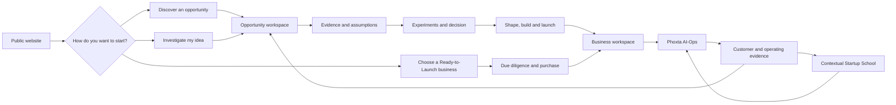
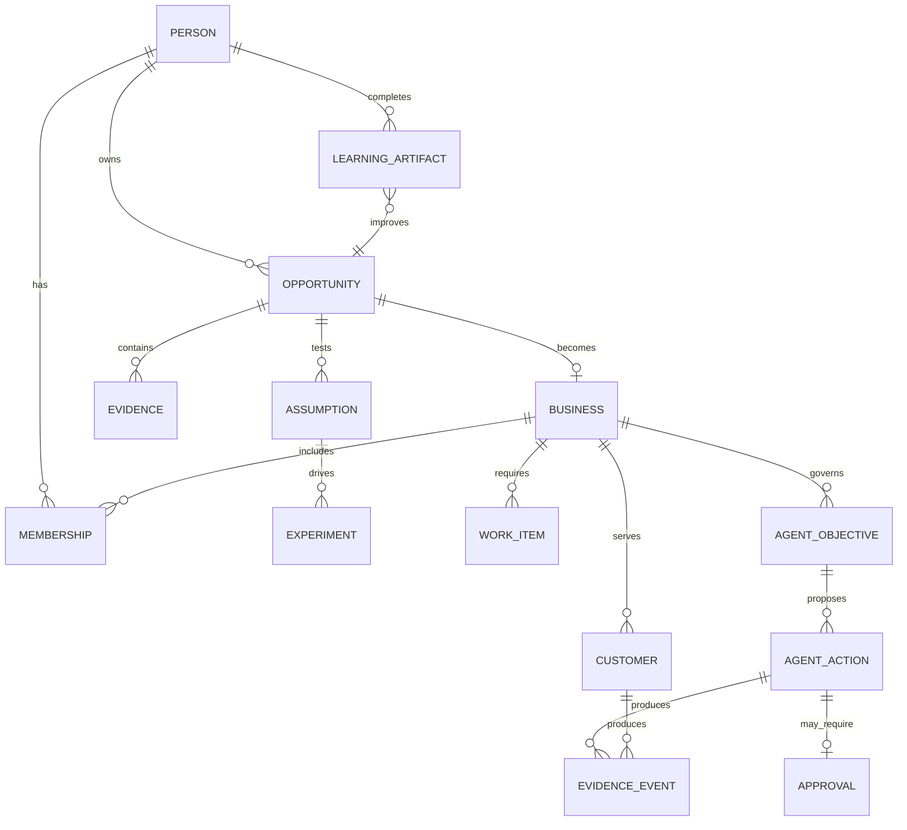
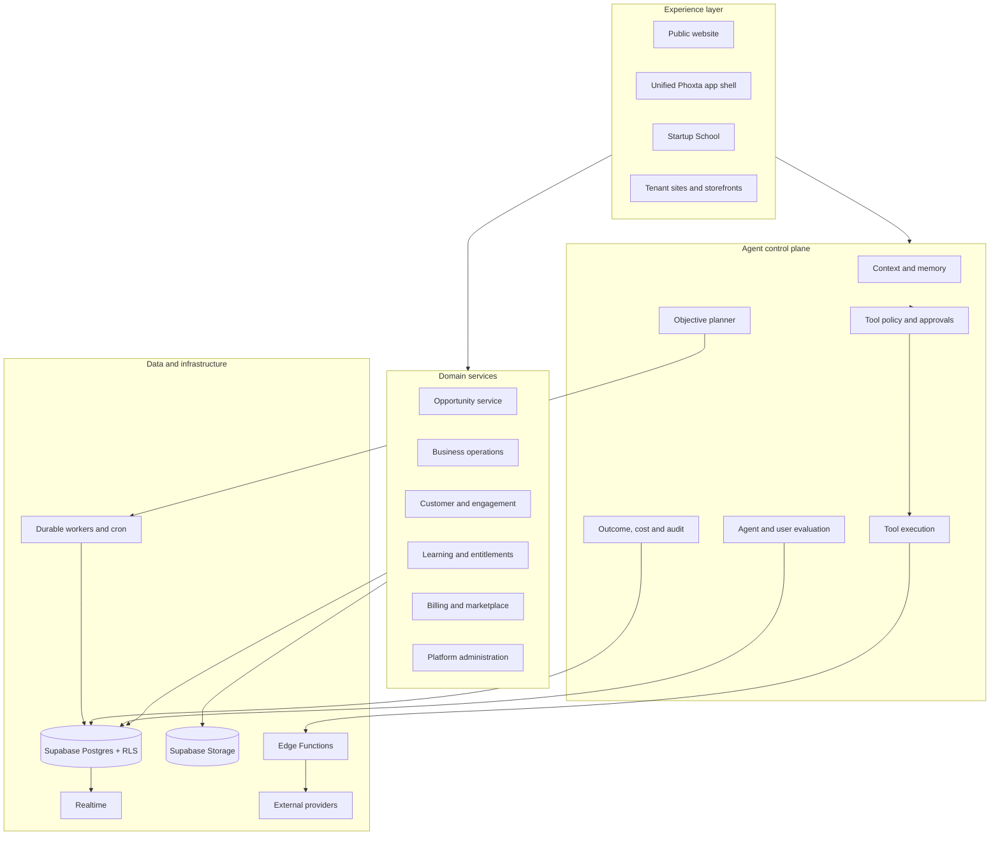

# Phoxta product blueprint and capability audit

**Status date:** 2 October 2026  
**Scope:** Phoxta public website, Phoxta AI-Ops, Opportunity Engine, Ready-to-Launch Businesses, Startup School, platform administration, integrations, workers, and adjacent products found in the repository.

## 1. Executive definition

Phoxta should be one agentic venture operating system that helps a person move through the full business lifecycle:

> **Discover an opportunity, prove what must be true, launch the business, operate it with AI, and improve through evidence.**

The repository already contains most of this lifecycle, but it does not yet feel like one product. The current code has:

- a clean new AI-Ops shell at `/app`;
- a largely complete Opportunity Engine that is no longer routed into the authenticated app;
- an older but much broader operating dashboard under `/dashboard`;
- a separate, highly developed Startup School application;
- Ready-to-Launch business blueprints and deployable business applications;
- a large agent, workflow, integration, billing, research, and administration backend.

The right product move is to preserve the new visual concept and make it the only authenticated shell. Existing working capabilities should be mounted inside that shell through shared domain services. Users should not be redirected into the old dashboard.

Phoxta's defensible product is the combination of four systems:

1. **Opportunity Intelligence** finds and investigates evidence-backed opportunities.
2. **Venture Creation** turns evidence into decisions, offers, assets, workflows, and launch plans.
3. **AI-Ops** operates the launched business with governed agents and human approvals.
4. **Startup School** teaches the exact skill a user needs when their work shows a gap.

Ready-to-Launch Businesses provide a second entry point for users who want to skip discovery and begin with a developed business.

## 2. Audit method and status language

This audit uses the current routes, React screens, database clients, Supabase migrations, Edge Functions, workers, product specifications, and the new Phoxta app shell. A file or table is evidence that a capability exists in code; it is not proof that every production credential, migration, webhook, or provider is active.

| Status | Meaning |
|---|---|
| **Active in new app** | Exposed through the new `/app` shell and connected to current data or server actions. |
| **Partly active** | Visible in the new shell, but an important part is local-only, duplicated, static, or incomplete. |
| **Active in legacy UI** | A working screen exists under `/dashboard`, but it has not been brought into the new shell. |
| **Built but disconnected** | Domain logic, screens, tables, or workers exist, but the current primary product navigation does not expose them. |
| **Backend-ready** | Data model and/or server capability exists without a complete current user flow. |
| **Provider-dependent** | The flow needs external credentials or an approved provider connection; without them it may simulate or return a configuration error. |
| **Adjacent product** | Present in the same repository but should remain a separate product or packaged business rather than become Phoxta core navigation. |

## 3. Recommended product architecture

Phoxta should be presented as one product with three workspace modes and two acquisition paths.

### 3.1 Workspace modes

#### Opportunities

For people deciding what to build or whether an idea is worth pursuing.

- Discover opportunities.
- Create or investigate an idea, problem, industry, trend, or technology.
- Build an Opportunity Brief with sources and evidence.
- Map assumptions and run experiments.
- Make a traceable proceed, revise, pause, or stop decision.
- Shape the offer and business model.
- Produce the launch package and create a business workspace.

#### Phoxta AI-Ops

For people operating a business.

- Handle customers and communication.
- Run bookings, orders, reservations, invoices, and fulfilment.
- Create campaigns, graphics, pages, and social content.
- Give agents objectives and tool permissions.
- Review approvals, notifications, tasks, and outcomes.
- Learn from performance and customer signals.

#### Startup School

For contextual learning and structured founder development.

- Follow the 12-module venture curriculum.
- Complete lessons, exercises, templates, and artifacts.
- Join cohorts, live classes, groups, and mentoring where entitled.
- Build a venture, run experiments, and receive adviser support.
- Receive course recommendations based on real work in Phoxta.

### 3.2 Acquisition paths

#### Create a venture

`Discover -> Investigate -> Validate -> Shape -> Build -> Launch -> Operate -> Learn`

#### Acquire a developed business

`Browse Ready-to-Launch -> Due diligence -> Select package -> Purchase/license -> Configure -> Launch -> Operate -> Learn`

Both paths should end in the same business workspace and AI-Ops control system.



## 4. Complete capability inventory

### 4.1 Public website and acquisition

| Capability | Current status | Notes |
|---|---|---|
| Homepage | Active | New Phoxta navigation, hero, core proposition, Ready-to-Launch preview, AI-Ops showcase, pricing, editorial content, and calls to action. |
| Public marketplace | Active | `/marketplace` contains the public product archive; `/discover` and `/businesses` currently redirect to it. |
| Ready-to-Launch catalogue | Active/partial | Public catalogue, internal marketplace, blueprints, price display, scorecards, purchase paths, and business creation code exist. The public information architecture still collapses discovery and businesses into one marketplace route. |
| Pricing | Active | Public pricing page and authenticated billing flows exist. Product packaging needs consolidation across AI-Ops, Opportunities, School, and business purchases. |
| Resources and blog | Active | Article catalogue, article pages, live platform overrides, editorial publishing, images, and share links exist. |
| Startup School landing | Active | Public entry point at `/startup-school` and `/school`; paid learning app is separate. |
| Founder Toolkit | Active | Public founder journey, stage pages, tools, and adviser entry points. |
| AI technology page | Active | Public AI capability and service presentation. |
| About, FAQs, careers, contact, privacy, terms | Active | Standard public trust and lead-capture surfaces. |
| Public help centres | Active | Per-tenant help centre and article routes at `/help/:org`. |
| Published tenant sites | Active | Tenant pages served at `/site/:orgId/:slug`. |
| Customer rating and unsubscribe | Active | Public action routes for feedback and communication preferences. |
| Portfolio host | Adjacent | Femi portfolio is host-routed and should remain separate from the Phoxta product definition. |

### 4.2 Identity, onboarding, organisations, and commercial access

| Capability | Current status | Notes |
|---|---|---|
| Email/password authentication | Active | Supabase authentication and protected routes. |
| OAuth authentication | Provider-dependent | Google, Azure, GitHub, and Apple UI support is environment-driven. |
| Terms and marketing consent | Built | Terms acceptance and optional marketing consent are separated in the Phoxta 2.0 work. |
| User profile and onboarding | Active/partial | Profile, goals, company context, and onboarding completion exist. The new account popup still contains static/no-op fields that should call these services. |
| Multi-business membership | Active | A user can belong to multiple organisations and switch the active business. |
| Team invitations and roles | Built | Invitations, acceptance, revocation, owner/admin/staff/viewer roles, and ownership-related flows exist. The new Team and Invite popups are not yet wired to them. |
| Billing and subscriptions | Active in legacy UI | Subscription listing, plan changes, cancellations, purchases, and callbacks exist. |
| Stripe billing | Provider-dependent | General subscriptions, Stripe Connect, opportunity billing, Startup School checkout, and signed webhooks exist as separate flows. |
| Paystack billing | Provider-dependent | General checkout, storefront checkout, refunds, and webhooks exist. |
| Entitlements and plan limits | Built | Data-driven Opportunity entitlements and Startup School tier gates exist. Production state must be verified separately from code. |
| Data export, privacy requests, deletion | Built but disconnected | Opportunity export/deletion flows, retention rules, and account-deletion processing exist, but are not surfaced in the new account UI. |

### 4.3 Opportunity discovery and venture creation

This is one of the most complete hidden parts of the product. Its React pages and domain services exist, but `/app/*` is now owned by the new AI-Ops shell. Only Opportunity administration remains routed through `/admin/*`.

| Capability | Current status | Notes |
|---|---|---|
| Discovery onboarding | Built but disconnected | Captures goals, skills, industries, markets, models, advantages, time, capital, complexity, and entry mode. |
| Discovery entry modes | Built but disconnected | Explore for me, industry exploration, problem-first, idea investigation, trend/technology concepts, and browse. |
| Opportunity feed | Built but disconnected | Search, filters, categories, saved items, dismissals, fit explanations, and explainable ranking. |
| Opportunity ranking | Built | Ranks against evidence, customer clarity, timing, model, skills, markets, and user constraints without claiming success probability. |
| Opportunity workspace | Built but disconnected | Lifecycle, thesis, Brief, evidence, assumptions, experiments, artifacts, and next actions. |
| Opportunity lifecycle | Built | Discovered, investigating, unproven, testing, promising, shaping, building, launching, learning, paused, rejected, and archived. |
| Opportunity Brief | Built | Editable structured sections, evidence links, version history, comparison, proposed changes, and acceptance. |
| Sources and evidence | Built | Provenance, source metadata, evidence types, confidence labels, excerpts, interpretations, geography, and timestamps. |
| Assumption map | Built | Problem, customer, value, behaviour, payment, distribution, solution, operations, and regulatory assumptions with importance, uncertainty, and status. |
| Experiments | Built | Interview, landing page, concierge, prototype, waitlist, paid pilot, preorder, outreach, and smoke-test experiments; observations and outcomes are supported. |
| Decision review | Built | Proceed, revise, pause, or stop with an immutable evidence snapshot and rationale. |
| Market analysis | Built | Customers, alternatives, competition, market evidence, and research artifacts. |
| Shape | Built | ICP, value proposition, offer, positioning, and business-model artifacts. |
| Build | Built | MVP, brand, website, workflows, agents, tasks, files, and integrations as versioned artifacts. |
| Workflow designer | Built | Graph-based workflows and dry-run testing; production external actions remain governed. |
| Launch | Built | Go-to-market plan, channels, campaigns, sales, metrics, and launch artifacts. |
| Exports | Built | PDF and DOCX Opportunity Brief exports with source references, plan-aware output, and private-file rules. |
| Private collaboration | Built | Workspace roles, invitations, private storage, signed links, and read-only viewers. |
| Opportunity notifications | Built | Preferences and in-app notification records. |
| Opportunity billing | Backend-ready | Plan limits, usage accounting, checkout, grace periods, webhook handling, and entitlement overrides. |
| Editorial opportunity administration | Active at `/admin/*` | Global opportunity, taxonomy, source, research, publication, and business-listing operations. |
| Durable research worker | Built; deployment-dependent | Queue leases, provider adapters, retries, cancellation, cost reservation, source extraction, synthesis, critic, quality gates, and stale-data refresh. |
| Research providers | Provider-dependent | Brave primary search, Tavily fallback, and Anthropic synthesis are specified in the current implementation record. |
| Legacy migration | Built | Per-record preview/reporting, preservation of historical data, and hypothesis labels. |

### 4.4 New Phoxta AI-Ops shell

#### Global shell

| Capability | Current status | Notes |
|---|---|---|
| Clean responsive shell | Active in new app | Header, compact expanding sidebar, central work area, right rail, mobile navigation, and account menu. |
| Business selector | Active | Changes the organisation used by the new app's live queries. |
| Today, Customers, Operations, Growth, Intelligence | Active | These are the five current top-level operating areas. |
| Workspace selector | Partly active | Phoxta AI-Ops, Opportunities, and Startup School appear at lower left, but the radio choices do not yet switch applications. This should become the main product-mode switch. |
| AI/Human loop controls | Partly active | The visual toggle exists per sidebar area, but it is local React state. It does not yet persist to the real `agent_tool_policy` controls. |
| Account dropdown and dialogs | Partly active | Profile upload preview and logout work; Profile, Billing, Settings, Team, Invite, and Support contain several static or no-op actions. |
| Quote of the day | Active but basic | Business-labelled quotes display; recommendation logic is currently a small static list. |

#### Customers workspace

| Capability | Current status | Notes |
|---|---|---|
| Unified inbox | Active in new app | Reads real conversations and contact timelines. |
| Web chat, email, WhatsApp | Active/provider-dependent | One conversation model supports channel filtering. Email and WhatsApp have wider single-message layouts. |
| Rich email rendering | Active | Displays stored HTML, imports/backfills Gmail HTML, and shows one selected email rather than stacked messages. |
| Sender avatars | Active | Uses supplied profile images, corporate-domain favicons, and generic individual avatars. |
| Reply sending | Active/provider-dependent | Replies through the conversation service; delivery depends on configured providers. |
| Calls | Active/provider-dependent | Starts AI or bridged calls and displays recent calls and outcomes. |
| Bookings | Active | Lists bookings and changes status. Full service configuration remains in the legacy screen. |
| Customer directory | Active | Searches contacts and creates new contacts. Full CRM editing and activity are richer in the legacy UI. |
| Audience | Active | Reads segments and audience counts. Segment creation/editing is available in older screens and domain services. |
| Automations | Active | Lists and toggles automations. Full creation, run history, and flow editing remain outside the new shell. |
| Campaigns | Active | Lists campaigns and creates drafts. Scheduling, audience selection, templates, and detailed results remain richer in legacy screens. |
| Graphics and social queue | Active | Uploads design assets, lists social posts, and can send queued posts. Full editor and connection management remain in legacy screens. |
| Channels | Active/read-only | Shows connected web chat, voice, email, and conversation channel counts. Connection/setup belongs in older settings screens. |
| AI assistant configuration | Active | Reads and saves agent name, tone, greeting, persona, and job definition. |
| Customer insights | Active | Shows flows, live flow counts, touches, and unique people reached. |

#### Today, Operations, Growth, and Intelligence

| Capability | Current status | Notes |
|---|---|---|
| Today overview | Active | Shows orders, unread messages, approvals, revenue, and a work board from live business data. |
| AI Operator tab | Active | Configures the customer-facing assistant. It is not yet the full operator console available in the legacy UI. |
| Activity tab | Partly active | Route falls through to the generic Today dashboard instead of a distinct activity log. |
| Operations overview | Active | Shows operating metrics and work-board cards. |
| Operations approvals | Partly active | The tab exists, but it falls through to the generic Operations dashboard rather than opening the real agent action approval queue. |
| Operations bookings | Active | Opens live booking data. |
| Growth overview | Active | Shows campaign totals, scheduled items, sent count, and failures. |
| Growth customers | Active | Opens the live customer directory. |
| Growth graphics | Active | Opens assets and social publishing. |
| Intelligence performance audit | Active | Uses recent behaviour, user action outcomes, agent actions, and audit events to score focus, execution, customer care, and learning; it gives advice and Startup School recommendations. |
| Intelligence Playbook and Research | Partly active/mislabelled | Both routes currently render the same customer-flow insight view. They do not expose the existing agent memory, knowledge base, or Opportunity research pipeline. |

#### Cross-app rails and assistance

| Capability | Current status | Notes |
|---|---|---|
| Notifications rail | Active | Combines database notifications and live agent activity. Items open detail cards and identify channel/media context. |
| Tasks rail | Partly active | Displays live work and agent activity. Edits and newly created tasks are stored in browser local storage, so they are not shared or durable across devices. |
| Calendar rail | Active/partial | Combines bookings and work-board events, supports month navigation and event detail. It needs a canonical event/task model for full editing. |
| Contextual cursor AI | Active | Appears near the user's cursor, detects the local screen context, suggests relevant actions, streams tool activity, and invokes the governed operator. |
| Voice instruction | Active/browser-dependent | Uses browser speech recognition where available. |
| Context attachments | UI-only | The popup records selected file names, but does not upload or send file contents through the existing operator file service. |
| Autopilot | Active | Starts and pauses real agent objectives, streams presence, and shows work in tasks and notifications. |
| Behaviour learning | Active | Batches navigation, active time, pointer patterns, clicks, field edits, selected safe content, and action outcomes into organisation-scoped events. |
| Performance coaching | Active | Turns behaviour and outcome evidence into strengths, improvements, and course suggestions. |

### 4.5 Broader operating capabilities in the legacy UI

These are functional product capabilities that should be ported into the new shell. They should not remain as separate visual concepts.

| Area | Built capabilities | Current status |
|---|---|---|
| AI Operator | Streaming operator chat, attachments, persistent conversation history, tool calls, approvals, editable action arguments, audit log, memory notes, Telegram connection, Stripe connection, policies, and budgets. | Active in legacy UI/backend. |
| Agent configuration | Persona, greetings, tone, knowledge documents, canned replies, business rules, operator rules, capabilities, locations, voice selection, and test conversations. | Active in legacy UI. |
| Autopilot | Objectives, schedules, constraints, run history, per-day action/call/email ceilings, repeated-failure stopping, and cron health. | Active/backend-ready. |
| Omnichannel inbox | Email, SMS, WhatsApp, web chat, Chatwoot, voice, assignments, tags, notes, snooze, AI pause, presence, templates, suggested replies, summaries, and command palette. | Active in legacy UI/backend. |
| AI call centre | Multi-location configuration, inbound/outbound calls, after-hours answering, appointment scheduling, reminders, instant callback, receptionist, qualification, cold calling, nurturing, and upsell. | Provider-dependent. |
| CRM | Contacts, stages, values, tags, notes, interaction history, activity timeline, and board views. | Active in legacy UI. |
| Commerce | Products, images, pricing, stock, variants, order creation, order items, fulfilment, tracking, cancellation, restocking, customer notifications, and refunds. | Active in legacy UI/provider-dependent for refunds. |
| Invoicing | Draft invoices, items, numbering, status transitions, sending state, and deletion of drafts. | Active in legacy UI. |
| Bookings | Services, availability, booking creation, status, customer notifications, and calendars. | Active in legacy UI. |
| Reservations | Tables/resources, overlap checks, capacity, availability, blackouts, confirmation/cancellation notices, and refunds. | Active in legacy UI. |
| Marketing | Contacts, segments, campaign creation, email-derived campaigns, scheduling, queues, sends, automations, and run history. | Active in legacy UI/backend. |
| Engagement flows | Visual flows, journeys, nodes, edges, execution runs, touches, broadcasts, channel setup, and performance statistics. | Active in legacy UI/backend. |
| Design studio | Templates, canvas editor, layers, text formatting, image library, AI images, stock search, background removal, reference recreation, variants, raster export, content plans, calendars, and social scheduling. | Active in legacy UI/provider-dependent. |
| Email studio | Block-based email composition, presets, templates, test sends, production sends, and conversion of posts into emails. | Active in legacy UI/provider-dependent. |
| Social publishing | Instagram, LinkedIn, TikTok, and X connections; captions; per-platform options; scheduling; immediate publishing; retry/cancel; and insights. | Active in legacy UI/provider-dependent. |
| Content planning | Strategy inputs, coverage checks, platform validation, generated plans, planned posts, dropped-item explanations, and staged plan execution. | Backend and legacy UI. |
| CMS and tenant websites | Pages, visual pages, rich documents, publish/unpublish, tenant content, previews, reusable page builder, and public delivery. | Active in legacy UI. |
| Domains | Search, checkout, DNS records, verification, primary domain selection, and removal. | Provider-dependent. |
| Help centre | Articles, categories, publication, public help pages, support tickets, AI draft replies, and outbound replies. | Active/provider-dependent. |
| Business dossier | Blueprint dossier, owner context, section generation, imagery, progress, and business-specific operating document. | Active/backend-ready. |
| Google Workspace | OAuth, Gmail listing/reading/sending/import, HTML backfill, managed addresses, Drive, Calendar, Docs, and Sheets. | Provider-dependent. |
| Analytics | Revenue, operations, agent summaries, event logging, recent events, email health, marketing performance, calls, and social metrics. | Active but fragmented. |
| Business settings | Brand, profile, hours, team, service policies, channels, social settings, payments, and integrations. | Active in legacy UI. |

### 4.6 Agentic backend

Phoxta already has a meaningful governed-agent foundation.

#### Agent tools currently defined

- **Commerce:** create product, change price, set stock, publish/archive products, fulfil orders, and change order status.
- **CRM:** create contacts, move stages, add notes, and tag contacts.
- **Invoicing:** create invoices and change invoice status.
- **Bookings and reservations:** create services, create bookings, change booking/reservation status, and block availability.
- **Content:** create blog posts and publish pages.
- **Inbox:** automatic replies, conversation replies, conversation status, and assignment.
- **Helpdesk:** create, reply to, and update tickets.
- **Marketing:** create and send campaigns.
- **Call centre:** add locations.
- **Outreach:** send email/SMS/WhatsApp messages and place calls.
- **Google Workspace:** send email, create documents, create calendar events, and append rows to Sheets.
- **Read and lookup tools:** business/customer/order/service/content/context retrieval, semantic search, and media discovery.
- **Media tools:** search product photography, designs, and business assets, then attach a selected supported file.

#### Governance currently built

- Each write tool supports `off`, `approve`, or `auto` policy modes.
- Most write tools default to approval; automatic reply is the explicit exception.
- Proposed actions are stored before execution.
- A human can approve, reject, or edit action arguments.
- Executed actions create audit entries.
- Agent objectives have schedules, constraints, status, and run history.
- Daily action, call, and email ceilings exist.
- Repeated failures can stop an objective.
- Organisation-level memory notes and a semantic knowledge base exist.
- Provider actions degrade to an explicit configuration or simulated state where coded; the product must never display a simulated action as delivered.

### 4.7 Integrations and channels

| Integration | Built capability | Activation dependency |
|---|---|---|
| Supabase | Auth, Postgres, storage, realtime, RLS, Edge Functions | Core platform configuration. |
| OpenAI | Text/image capability, embeddings, design generation, some agent services | API key and usage controls. |
| Anthropic | Opportunity research planning/synthesis/critic | API key and model-rate configuration. |
| Brave Search | Opportunity research retrieval | API key. |
| Tavily | Research fallback | API key. |
| Twilio | SMS, WhatsApp, inbound/outbound voice, browser voice token, status callbacks | Account credentials, phone numbers, approved WhatsApp setup. |
| Resend/Postmark | Transactional and conversation email delivery | Provider credentials and sending domains. |
| Google Workspace | Gmail, Drive, Calendar, Docs, Sheets, managed email provisioning | OAuth client and user connection. |
| Stripe | Subscriptions, business purchase, Connect, Startup School, Opportunity billing | Keys, products/prices, and signed webhooks. |
| Paystack | Checkout, storefront payments, refunds | Keys and webhook. |
| Instagram/Meta | Social connection and publishing | App configuration and granted account scopes. |
| LinkedIn | Social connection and publishing | App configuration and granted scopes. |
| TikTok | Social connection and publishing | App configuration and granted scopes. |
| X | Social connection and publishing | App configuration and granted scopes. |
| Telegram | Owner linking, inbound commands, digests, setup, and mini app | Bot token and webhook. |
| Pexels/stock | Stock image search | API key. |
| Render service | Raster/media rendering | Render endpoint and secret. |
| Vercel | Web hosting and production deployment | Linked project. |
| MCP storefront | Storefront-facing machine interface | Deployment and access policy. |

### 4.8 Startup School

Startup School is a substantial product rather than a simple course page.

| Capability | Current status |
|---|---|
| Separate authentication, password recovery, and security settings | Built |
| Paid entitlement gate and payment callbacks | Built; checkout configuration must be verified live |
| Selected-tier access | Built |
| 12-module Opportunity curriculum | Built |
| Courses, lessons, blocks, examples, exercises, templates, resources, and AI activities | Built |
| Artifact-linked completion and historical progress preservation | Built in the Phoxta 2.0 curriculum work |
| Learn, Build, Connect, and More hubs | Built |
| Opportunity practice by module | Built |
| Tasks, venture workspace, experiments, adviser, and progress | Built |
| Quizzes and attempts | Built |
| Certificates | Built |
| Live lessons, RSVPs, participants, chat, captions/transcripts, recordings, and recaps | Built/provider-dependent |
| Cohorts, groups, posts, bookmarks, and follows | Built |
| Learner inbox and conversations | Built |
| Mentors, availability, sessions, booking notes, actions, and transcripts | Built |
| Notifications and settings | Built |
| Launch support and catalogue allocation | Built for Launch tier |
| Staff teaching, content, people, operations, support, classroom, and security workspaces | Built |
| Staff roles, invites, assignments, content revisions, audit, and support tickets | Built |

The intended commercial terms previously directed for the selected-tier model are:

- **Self-study: £50**
- **Cohort: £250**
- **Launch: £2,500**

Older implementation notes contain historical prices. Those should not override the selected commercial terms without an explicit product decision.

### 4.9 Ready-to-Launch businesses and packaged applications

The repository contains business packages and deployable applications for:

- Carento;
- Coir Six;
- Ferne;
- Gearo;
- Niche Apparel;
- Restaurant Orders;
- Startup School;
- Wafe;
- WamWam.

The marketplace and blueprint models support titles, verticals, prices, assets, cover images, scorecards, purchase records, subscriptions, and creation of an organisation from a purchased blueprint.

Ready-to-Launch should become a provisioning system, not only a catalogue. A completed purchase should create:

1. the organisation;
2. the correct vertical configuration;
3. products/services/content and starter data;
4. brand and website assets;
5. agent knowledge and tool policies;
6. launch checklist and objectives;
7. owner access and onboarding;
8. integration setup tasks;
9. a visible list of what is complete, assumed, or still requires the owner.

### 4.10 Platform administration

The platform administration layer includes:

- overview metrics;
- tenants and lifecycle stages;
- subscriptions and purchases;
- revenue and provider margin;
- users, recovery links, bans, and business access;
- platform administrator management;
- leads and lead status;
- blueprint publication controls;
- platform posts and editorial overrides;
- business support access;
- payment tests;
- audit log;
- worker/cron heartbeats;
- Opportunity editorial and research administration;
- Startup School staff operations.

### 4.11 Adjacent products in the repository

These should share platform services where useful but should not be mixed into Phoxta's primary navigation.

- **Jobtra:** job search/application product with CVs, connected accounts, Gmail, settings, applications, and AI analysis.
- **Wafe/WamWam:** family/life operating system with a very large independent domain model.
- **Coir Six:** learning product with mobile and live-class functionality.
- **Portfolio:** separate host and personal presentation product.

## 5. Current product problems

### 5.1 Three interface generations compete

The new app is visually coherent but exposes only part of the platform. The old dashboard contains many mature capabilities. The Opportunity Engine has a third visual system and is mostly unrouted. This makes built features appear missing and encourages redirects that break the redesign concept.

**Decision:** the new `/app` shell becomes the sole authenticated Phoxta UI. Port views and domain components into it. Keep old routes temporarily as compatibility aliases, then retire them.

### 5.2 Workspace modes are visual, not functional

The lower-left `Phoxta AI-Ops`, `Opportunities`, and `Startup School` selector is currently a set of radio buttons without navigation or shared state.

**Decision:** make it a real mode switch:

- `/app` -> AI-Ops;
- `/app/opportunities` -> Opportunity mode;
- `/app/learn` -> embedded School mode or a deep-linked School session with shared identity and return context.

### 5.3 Some new-shell controls are not wired

- AI/Human sidebar modes use local component state rather than tool policies.
- New tasks and task edits use local storage.
- account Profile/Billing/Settings/Team/Invite/Support contain no-op or static controls;
- AI context attachments send file names rather than actual uploaded content;
- Operations Approvals is not the real approval queue;
- Activity is not a distinct activity view;
- Intelligence Playbook and Research show the same customer-flow list;
- the full Opportunity product is hidden by the `/app/*` route;
- `TodayWorkspace.tsx` is unused mock UI and duplicates real features.

These are credibility risks because the interface suggests that data was saved or work was performed when it may only have changed local state.

### 5.4 Overlapping concepts need canonical models

The code contains several versions of similar ideas:

- automations, engage flows, agent workflows, proactive automations, and outbound campaigns;
- notifications, agent activity, audit events, work-board cards, and tasks;
- organisations, businesses, blueprints, listings, opportunities, ventures, and purchased packages;
- AI conversations, operator messages, customer conversations, tickets, and School conversations.

These can coexist only if each has a precise role. The UI should read from a canonical projection rather than teaching users the storage model.

### 5.5 Production readiness varies by provider

Several services intentionally simulate or return configuration errors when credentials are absent. That is useful for development, but production UI must show one of three honest states:

- **Connected and delivered**;
- **Connected but failed**;
- **Not connected; preview/simulation only**.

A simulated social post, email, call, or workflow must never appear as an externally completed action.

### 5.6 Behaviour learning needs a dedicated privacy model

The new learning layer currently stores categorical behaviour and selected content samples in `analytics_events`. The established retention policy says product analytics must not contain research text, interview notes, or source excerpts. Customer response samples should follow the same conservative rule.

**Required correction:**

- keep `analytics_events` categorical;
- store any content-derived learning in a separate encrypted, access-controlled behavioural-memory store;
- make collection purpose, retention, and user controls explicit;
- allow pause, review, correction, export, and deletion;
- redact secrets and sensitive data before storage;
- retain derived preferences only when the underlying evidence remains available;
- do not infer protected or sensitive personal traits.

## 6. Target information architecture

The clean design can support the whole product without becoming crowded.

### 6.1 Global layer

- Phoxta logo/home.
- Autopilot status.
- Current business or venture selector.
- Workspace mode selector.
- Contextual AI.
- Notifications, tasks, and calendar.
- Account, billing, team, integrations, privacy, and support.

### 6.2 AI-Ops mode

Keep the current five-item sidebar:

1. **Today** — priorities, objectives, approvals, activity, and performance exceptions.
2. **Customers** — conversations, contacts, audience, bookings, and channels.
3. **Operations** — orders, fulfilment, invoicing, reservations, tasks, workflows, and approvals.
4. **Growth** — campaigns, content, graphics, social, website, and performance.
5. **Intelligence** — business performance, customer insights, knowledge, research, agent evaluation, and user coaching.

Use the compact area switcher inside each screen for specialist views. Do not add every capability to the main sidebar.

### 6.3 Opportunities mode

Use a similarly compact sidebar:

1. **Today** — next action and portfolio status.
2. **Discover** — For You, Browse, Industries, Problems, Trends, Saved.
3. **Opportunities** — all lifecycle stages and workspaces.
4. **Validate** — assumptions, experiments, evidence, and decisions across the portfolio.
5. **Build** — shaping, build, launch, and handoff into AI-Ops.

### 6.4 School mode

1. **Today** — next lesson, task, session, and venture action.
2. **Learn** — path, courses, lessons, practice, and progress.
3. **Build** — venture, experiments, artifacts, and adviser.
4. **Connect** — groups, inbox, mentors, live lessons, and sessions.
5. **Launch** — available when entitled.

## 7. Canonical product model

The product should be organised around six canonical objects.

### 7.1 Person

Identity, profile, preferences, consent, memberships, roles, learning entitlements, and working style.

### 7.2 Opportunity

The thesis being investigated, its customer/problem, Brief, sources, evidence, assumptions, experiments, decisions, and lifecycle.

### 7.3 Business workspace

The operating organisation, brand, website, products/services, customers, channels, money, workflows, files, and integrations.

### 7.4 Work item

A canonical task, approval, exception, objective step, booking obligation, campaign job, research job, or follow-up. It needs a shared status model, owner, due date, source, related object, and outcome.

### 7.5 Agent action

A proposed or executed tool call with context, policy, risk, approval state, arguments, result, cost, and audit trail.

### 7.6 Evidence event

An immutable observation from a user, customer, system, experiment, integration, or agent. Evidence updates decisions, metrics, coaching, and memory without silently rewriting history.



## 8. Target user flows

### 8.1 User has no idea

1. Create account and set optional discovery preferences.
2. Choose `Explore for me`.
3. Review opportunity cards with evidence strength, uncertainty, and fit explanations.
4. Save, dismiss, or investigate.
5. Create an Opportunity workspace.
6. Review the initial Brief and what is known, inferred, or unknown.
7. Approve a research plan and budget.
8. Review sourced findings and corrections.
9. Prioritise assumptions and create the smallest useful experiments.
10. Complete a decision review.
11. Shape, build, and launch if evidence supports proceeding.
12. Create the AI-Ops business workspace with all accepted artifacts attached.

### 8.2 User already has an idea

1. Enter the idea in plain language.
2. Intake agent extracts proposed customer, problem, solution, geography, and model; missing fields remain unknown.
3. Phoxta produces a thesis and assumption map rather than a success score.
4. User reviews and corrects the model.
5. Research and experiments address the highest-risk assumptions.
6. Decision review leads to proceed, revise, pause, or stop.

### 8.3 Existing business owner

1. Create or select the business.
2. Import/connect customer, product, service, and channel data.
3. Define the agent's knowledge, role, voice, and boundaries.
4. Set per-tool modes: off, approval, or automatic.
5. Create objectives with budgets, schedules, and stop conditions.
6. Use Today for exceptions and one next action.
7. Let agents perform routine work; review approvals for consequential work.
8. Inspect notifications, tasks, calendar, audit, and outcomes.
9. Use Intelligence to review customer, business, agent, and personal performance.
10. Follow contextual School recommendations where skills are limiting execution.

### 8.4 Ready-to-Launch buyer

1. Filter businesses by industry, model, capital, time, location, and readiness.
2. Review a standard package: customer/problem, evidence, assumptions, economics, assets, dependencies, costs, regulations, workload, and unknowns.
3. Preview the storefront/product and AI-Ops configuration.
4. Ask questions or request due diligence.
5. Select acquisition, licence, subscription, or launch-support terms.
6. Complete checkout and signed entitlement creation.
7. Provision the business workspace and starter assets.
8. Complete integration and owner-decision checklist.
9. Launch with an explicit readiness review.

### 8.5 Inbound customer interaction

1. A message arrives from web chat, email, SMS, WhatsApp, Chatwoot, or voice.
2. Phoxta resolves the contact and business context.
3. The agent retrieves approved knowledge and recent customer history.
4. The agent drafts an answer and any proposed actions.
5. Tool policy decides whether to stop, request approval, or execute.
6. Delivery status is recorded separately from generation status.
7. The customer timeline, CRM, tasks, and metrics update.
8. A notification explains exactly what happened and links to evidence.

### 8.6 Autopilot objective

1. Owner states an outcome, schedule, constraints, budgets, and forbidden actions.
2. Planner creates bounded steps using available tools.
3. Policy engine checks tool permissions and daily ceilings.
4. Read-only work executes first.
5. Consequential actions enter approval where required.
6. Agent executes approved/automatic actions idempotently.
7. Result, delivery, cost, and evidence are recorded.
8. Failures retry within policy; repeated failures stop the objective.
9. Tasks and notifications stream live progress.
10. Intelligence evaluates outcomes, not mere activity.

## 9. Product specification

### 9.1 Primary users

- aspiring founder who does not know what to build;
- idea holder who needs evidence;
- industry insider with domain knowledge;
- technical/AI builder seeking a valuable market;
- side-business seeker with time/capital constraints;
- existing founder seeking growth or automation;
- buyer/operator seeking a developed business;
- team member, adviser, mentor, or operator;
- Phoxta editorial, research, support, and platform staff.

### 9.2 Core jobs to be done

- Find a credible opportunity matched to me.
- Understand what is true, inferred, and unknown.
- Decide what to test before investing heavily.
- Turn evidence into an offer, workflow, and launch.
- Operate customer and business processes without assembling many tools.
- Delegate safely to AI while retaining control.
- Know what happened, why, and what needs attention.
- Learn the next skill in the context of real work.
- Acquire a prepared business and start faster.

### 9.3 Product principles

1. **Evidence before confidence.** Do not turn weak data into strong claims.
2. **Outcomes before activity.** A sent message is not success; customer response or resolved work is evidence.
3. **One next action.** Today should reduce ambiguity rather than display every metric.
4. **Progressive autonomy.** Assist, draft, ask, and auto are explicit states.
5. **Human control at consequence.** Publishing, purchases, refunds, pricing, commitments, and production changes need policy-aware gates.
6. **No invisible work.** Every agent action has status, result, cost, and audit.
7. **No fake delivery.** Simulation and generation are not external execution.
8. **Learning is attached to work.** Courses produce or improve real venture artifacts.
9. **A launch is a handoff, not an endpoint.** Business evidence returns to the Opportunity model.
10. **One shell, one identity, one evidence spine.** Product modes should feel connected.

### 9.4 Non-goals

- Predicting the probability of business success.
- Giving autonomous legal, financial, medical, or regulatory decisions.
- Publishing, purchasing, messaging, refunding, or changing prices outside the owner's policy.
- Presenting generated text as external research.
- Replacing specialist data sources when Phoxta should orchestrate them.
- Making every adjacent business application a Phoxta navigation item.

### 9.5 Functional requirements for the unified product

1. All current `/app` routes remain in the clean shell.
2. Opportunities and School become functional workspace modes.
3. No new-shell action may silently redirect to `/dashboard`.
4. Every displayed save/send/run action must call a durable service or clearly say it is a preview.
5. Tasks, approvals, notifications, and calendar events use a shared work-item projection.
6. Every agent write tool uses a persisted policy.
7. Every external action exposes generated, queued, sent, delivered, failed, or simulated state.
8. Opportunity artifacts can provision a business workspace without copying unaccepted hypotheses as facts.
9. AI-Ops evidence can update an Opportunity or create a new assumption/experiment.
10. Performance recommendations deep-link to the exact School lesson and associated artifact.
11. Users can review, correct, export, pause, and delete behavioural learning data.
12. Integrations show health, scopes, last sync, last error, and reconnect action.
13. Provider secrets remain server-side; all organisation data remains RLS-scoped.
14. Expensive work has budget reservation, idempotency, retry, and cancellation.

## 10. Target technical architecture

The repository is Vite + React + TypeScript + Supabase. A framework migration is not required to achieve the product architecture.



### 10.1 Experience layer

- Keep route-level code splitting.
- Break `PhoxtaApp.tsx` and `LiveWorkspace.tsx` into shell, navigation, work surface, rail, and domain-feature packages.
- Mount each feature through a capability registry rather than hard-coded path checks.
- Keep the visual proportions and interaction concept of the new design.

### 10.2 Domain layer

- Use domain services as the only path to Supabase.
- Consolidate duplicate concepts behind canonical interfaces before deleting data models.
- Add projections for Today, Tasks, Calendar, Notifications, and Intelligence.
- Keep Opportunity claims, evidence, and decisions immutable/versioned where required.

### 10.3 Agent control plane

Every agent action should follow one contract:

```text
Context -> Plan -> Retrieve -> Propose -> Policy check -> Approval if needed
-> Reserve budget -> Execute idempotently -> Verify delivery/outcome
-> Record audit/evidence -> Notify -> Learn
```

Required fields include organisation, user/objective, source context, tool, typed arguments, risk class, policy decision, approval, idempotency key, cost reservation, execution status, delivery status, result, evidence references, timestamps, and error.

### 10.4 Event and evidence spine

Introduce a canonical event envelope that can project into analytics, notifications, tasks, audits, customer timelines, and Intelligence without duplicating business logic.

```json
{
  "organization_id": "...",
  "actor_type": "user|agent|customer|integration|system",
  "actor_id": "...",
  "event_type": "conversation.replied",
  "object_type": "conversation",
  "object_id": "...",
  "status": "proposed|approved|executed|delivered|failed|simulated",
  "outcome": {},
  "evidence_refs": [],
  "sensitivity": "categorical|private|restricted",
  "occurred_at": "..."
}
```

### 10.5 Memory hierarchy

- **Session context:** current screen and temporary conversation.
- **User working preferences:** explicit or reviewable learned preferences.
- **Customer memory:** customer-specific history, permissions, and facts.
- **Business knowledge:** approved policies, products, services, and brand rules.
- **Opportunity evidence:** sourced, versioned, and never silently promoted from hypothesis.
- **Agent audit:** immutable proposed/executed action record.

Do not collapse these into one vector store.

## 11. What to add

### P0 additions

1. **Real workspace router** for AI-Ops, Opportunities, and School.
2. **Capability registry** describing route, permissions, status, required integration, available tools, and UI component.
3. **Canonical work-item service** replacing local task state and merging approvals, tasks, due work, and exceptions into projections.
4. **Persistent tool-mode controls** wired from the sidebar to `agent_tool_policy` at tool or policy-group level.
5. **Real approval view** using `agent_actions`, including editable arguments, risk explanation, and linked context.
6. **Integration health centre** with connection, scopes, last sync, last successful action, errors, and reconnect.
7. **Behavioural-learning privacy centre** with consent, pause, review, corrections, retention, export, and deletion.
8. **Delivery truth model** separating generated, queued, attempted, delivered, failed, and simulated.
9. **Opportunity-to-business handoff** that provisions only accepted artifacts and labels remaining assumptions.
10. **Direct School lesson links** with a required real-world artifact and return-to-work action.

### P1 additions

1. Cross-workspace command bar and universal search.
2. Objective templates per business vertical.
3. Agent evaluation suite for factuality, policy compliance, tone, delivery, customer outcomes, and cost.
4. Business health model driven by real outcomes and confidence bands.
5. Experiment creation from live customer signals.
6. Ready-to-Launch provisioning manifest and readiness checklist.
7. Unified file/context service for the contextual AI.
8. Portfolio view for owners with multiple businesses and opportunities.
9. Role-aware Today views for owner, operator, marketer, support, and adviser.
10. Outcome feedback on every agent notification: correct, incorrect, useful, undo, or teach.

### P2 possibilities

- Agent marketplace with Phoxta-owned, partner, and business-specific skill packs.
- Vertical operating packs for restaurants, rentals, education, commerce, professional services, and creators.
- Evidence-backed benchmarking across anonymised cohorts with explicit consent.
- Opportunity signals generated from aggregated live business problems.
- Automatic conversion of repeated manual work into a proposed workflow.
- Simulation sandbox that tests workflows against historical events before activation.
- Voice-first owner interface through phone and Telegram.
- Acquisition due-diligence room generated from the Opportunity Brief and live operating data.
- Business digital twin for scenario planning, with assumptions clearly separated from forecasts.
- Partner/adviser workspace for accountants, lawyers, marketers, mentors, and operators.

## 12. What to remove, merge, or improve

### Remove after migration

- unused `TodayWorkspace.tsx` mock capability screens;
- old dashboard-only UI shells once every required feature is ported;
- duplicate static data that pretends to be a live account, campaign, customer, task, or billing record;
- routes that redirect users between visual generations;
- duplicate notification and activity presenters after the event projection is in place.

### Merge behind one service

- automations, proactive automations, engage flows, and agent workflows;
- tasks, approval items, work-board cards, exceptions, and objective steps;
- platform/customer/operator notification streams;
- campaign and broadcast execution where their differences are only channel configuration;
- file and attachment services used by Operator, inbox, design studio, and Opportunity research;
- integration status and health checks.

### Improve rather than remove

- keep the new sidebar and central-stage design;
- make the sidebar AI/Human control real and risk-aware;
- replace generic Intelligence routes with Performance, Knowledge, Research, and Evaluation;
- keep contextual AI, but make its attachments real and show a preview of intended tool calls before consequential work;
- keep Autopilot, but require objective, constraints, budget, tool policy, and stop conditions;
- keep behaviour learning, but move content learning out of analytics and add user control;
- keep Startup School separate in learning experience while sharing identity, context, artifacts, and return links;
- keep Ready-to-Launch as a marketplace, but make provisioning and due diligence the core value.

## 13. Agentic maturity model

| Level | Behaviour | Product state |
|---|---|---|
| 0. Manual | User performs the work. | Existing forms and editors. |
| 1. Assist | AI explains, searches, drafts, or recommends. | Contextual AI and advisers. |
| 2. Propose | AI creates a structured action with preview and evidence. | Agent actions and approval queue. |
| 3. Execute with approval | Human approves consequential writes. | Tool policy `approve`. |
| 4. Bounded autopilot | AI executes allowed work inside objective, budget, schedule, and stop rules. | Objectives, ceilings, workers, and audit. |
| 5. Portfolio orchestration | AI coordinates several businesses/opportunities while humans govern policies and exceptions. | Future state. |

Phoxta should sell and communicate Level 4, not unrestricted autonomy. The differentiator is reliable execution with evidence and control.

## 14. Metrics

### North-star candidate

**Weekly evidence-backed progress events per active venture/business.**

Examples include a validated assumption, completed experiment, accepted decision, delivered customer action, fulfilled order, resolved issue, launched campaign with measured outcome, or accepted improvement.

### Supporting metrics

- time to first credible Opportunity Brief;
- percentage of claims with evidence references;
- critical assumptions tested per active opportunity;
- opportunity-to-launch conversion by explicit decision;
- time from Ready-to-Launch purchase to operational readiness;
- percentage of agent actions automatically completed within policy;
- approval acceptance, edit, and rejection rates;
- external delivery success by channel;
- customer response, resolution, booking, revenue, and retention outcomes;
- agent correction and undo rate;
- provider cost per successful outcome;
- integration health and sync freshness;
- contextual School recommendation started and applied to an artifact;
- weekly active businesses with at least one verified outcome;
- user trust signals: audit opens, source opens, corrections, policy changes, and autonomy level.

## 15. Prioritised implementation roadmap

### Phase 0: truth and safety, 1-2 weeks

1. Create a capability registry and mark each capability active, preview, disconnected, or provider-required in code.
2. Remove misleading success states from no-op and simulated actions.
3. Move content-derived behaviour samples out of analytics; add collection controls.
4. Wire sidebar AI/Human controls to real policy groups.
5. Make account Profile, Team, Invite, Billing, and Settings use existing domain services.
6. Replace local-only tasks with durable work items.

### Phase 1: one shell, 2-4 weeks

1. Make workspace modes functional.
2. Port the real approval queue, activity log, operator memory, knowledge, and policies into the new shell.
3. Port commerce, invoicing, reservations, full bookings, and CRM into Operations/Customers.
4. Port full marketing, designs, email studio, social connections, and CMS into Growth.
5. Replace legacy-route links with in-shell views.
6. Keep compatibility redirects only after equivalent views exist.

### Phase 2: venture loop, 3-5 weeks

1. Mount Opportunity discovery and workspace screens in Opportunities mode.
2. Verify/apply the pending opportunity schema and provider configuration in staging.
3. Connect Opportunity research progress to notifications/tasks.
4. Implement the accepted-artifact handoff into a business workspace.
5. Send post-launch evidence back into assumptions, experiments, and decisions.

### Phase 3: contextual learning, 2-3 weeks

1. Deep-link Intelligence recommendations to exact School lessons.
2. Pass the relevant business/opportunity artifact into the lesson.
3. Return completed work to Phoxta and update the original task.
4. Unify identity and entitlement awareness while preserving the School experience.

### Phase 4: Ready-to-Launch provisioning, 3-5 weeks

1. Define the package manifest and trust standard.
2. Build due diligence and dependency views.
3. Provision organisations, data, assets, policies, objectives, and checklists after signed purchase fulfilment.
4. Add launch readiness and owner acceptance.

### Phase 5: agent reliability and scale, continuous

1. Add end-to-end agent evaluations and replay.
2. Add cost/outcome observability.
3. Add workflow simulation.
4. Add per-vertical policy packs and objective templates.
5. Add portfolio orchestration only after single-business reliability meets targets.

## 16. Release gates

A capability is not complete because a component, table, or Edge Function exists. It is complete when:

1. the user can discover it in the new shell;
2. empty, loading, error, disconnected, permission, and mobile states work;
3. data is durable and organisation-scoped;
4. the action reports the truthful external delivery state;
5. agent use has a policy, approval rule, idempotency, budget, and audit where applicable;
6. notifications/tasks link back to the exact object;
7. analytics are categorical and privacy-safe;
8. integration failures have a recovery path;
9. keyboard and screen-reader behaviour is usable;
10. a production-like test verifies the provider or explicitly verifies preview mode;
11. the old route is retired only after equivalent capability exists;
12. product documentation states what is automatic, what needs approval, and what remains unknown.

## 17. Edge capability inventory

The server surface currently includes these grouped functions.

### Agents and automation

`agent-approve`, `agent-catchup`, `agent-inbound`, `agent-operator`, `agent-worker`, `ai-actions`, `ai-agent`, `ai-gateway`, `ai-helpdesk`, `automation-run`, `objective-planner`, `workflow-worker`, `qa-scorer`, `knowledge-build`, `embed-worker`, `engage-run`.

### Customer communication

`conversation-send`, `conversation-suggest`, `email-inbound`, `email-send`, `gmail-sync`, `google-connect`, `google-gmail`, `google-oauth`, `google-workspace`, `place-call`, `twilio-inbound`, `twilio-status`, `voice-outgoing`, `voice-session`, `voice-token`, `recording-url`, `ticket-reply`, `csat`, `unsubscribe`.

### Growth, content, and design

`brand-generate`, `brand-voice`, `brochure-send`, `campaign-run`, `content-plan`, `content-plan-run`, `design-assets`, `design-generate`, `design-reference`, `design-render`, `email-studio`, `social-callback`, `social-caption`, `social-connect`, `social-deauthorize`, `social-insights`, `social-publish`, `social-schedule`, `help-center`, `platform-posts`, `idea-image`.

### Commerce, payments, and web presence

`commerce-notify`, `domain-checkout`, `domain-manager`, `verify-domain`, `mcp-storefront`, `storefront-feed`, `stripe-checkout`, `stripe-connect`, `stripe-webhook`, `paystack-checkout`, `paystack-refund`, `paystack-storefront-checkout`, `paystack-webhook`.

### Opportunity and venture creation

`idea-run`, `idea-validate`, `dossier-image`, `dossier-run`, `founder-advice`, `opportunity-account-deletion`, `opportunity-billing`, `opportunity-stripe-webhook`.

### School and live learning

`startup-school-ai`, `startup-school-checkout`, `startup-school-staff`, `coir-live`, `coir-live-recap`.

### Platform and owner operations

`billing-alerts`, `demo-access`, `ops-maintenance`, `platform-lead`, `platform-users`, `telegram-digest`, `telegram-inbound`, `telegram-link`, `telegram-miniapp`, `telegram-setup`.

### Adjacent applications

`jobtra-ai`, `wafe-ai`.

## 18. Final product decision

Phoxta should not be marketed as a collection of AI tools, a generic business dashboard, a course platform, or an idea generator. It should be built and communicated as:

> **The evidence-led agentic operating system for finding, launching, and running businesses.**

The product already has enough breadth. The next advantage will come from composition and reliability:

- one shell;
- one workspace identity;
- one evidence spine;
- one governed action system;
- one path from opportunity to operation;
- one feedback loop from real business activity back to decisions and learning.

The highest-value work is therefore not adding another isolated feature. It is connecting the existing Opportunity, AI-Ops, Ready-to-Launch, and School systems so that every action advances the same venture and every agent can prove what it did.
